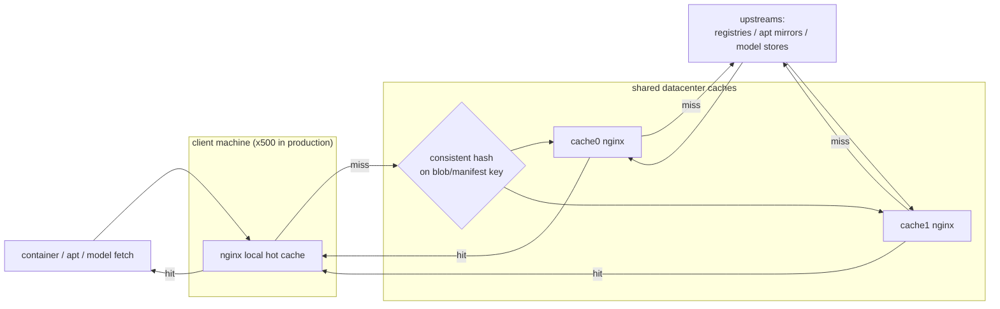

# object-caching-experiments

**A pull-through caching lab that makes AI/LLM containers start fast in a large datacenter by serving image, package, and model fetches from cache instead of the WAN.**

---

## The problem

Imagine a datacenter with **~500 client machines** all running AI/LLM container workloads.
Every time a job starts, each machine independently pulls the same things off the public
internet:

- **container images** — often many GiB (CUDA, PyTorch, vLLM, …),
- **`apt` packages** — base-image updates and build dependencies,
- **model weights** — Hugging Face / Ollama / ModelScope / PyTorch Hub downloads, frequently
  tens of GiB.

Done naively, that is 500× the WAN egress, 500× the latency, and 500× the chance a slow or
rate-limited origin (Docker Hub, in particular) stalls a cold start. The fix is **caching with
the right locality**:

1. **Best case — local hit.** Each client runs its own on-box cache; a repeat fetch never
   leaves the machine.
2. **Good case — datacenter hit.** On a local miss, the client asks a small set of **shared
   cache machines** inside the datacenter over the LAN — fast, and the WAN is touched once for
   the whole fleet.
3. **Last resort — WAN.** Only a fleet-wide first-touch reaches the public origin, and the
   result is cached at both tiers on the way back.

The aim is to push the hit-rate as high as possible at tier 1, catch the rest at tier 2, and
drive WAN egress toward zero — so container cold-start approaches local-disk speed.

The design is **generic**: any operator running a datacenter of container hosts can adopt it,
whatever the workload. RunPod images appear throughout these docs and tests only as one concrete
**example** fleet — a stand-in for "a large AI/ML container workload" — alongside vLLM, Ollama,
and the model stores. Substitute your own images and origins and the same two-tier caching
applies unchanged.

**This repository is a scaled-down, end-to-end working model of that target.** Instead of 500
clients it runs a handful (one NixOS client + three Ubuntu clients) against **two** shared cache
machines, all on an isolated virtual network, so the whole design can be built, booted, and
tested on a single host with one command.

---

## How a fetch flows



Every hop is `nginx` (OpenResty). A miss on the client's local cache is routed by a
**consistent hash** of the content key to one of the shared caches, so the fleet shares one
copy per blob; only a true fleet-wide first-touch reaches the WAN. The full per-protocol flows
(OCI pull, `apt`, Hugging Face) are diagrammed in
[`docs/01-overview.md`](docs/01-overview.md) §1.4.

---

## Table of contents

- [The fleet at a glance](#the-fleet-at-a-glance)
- [How it works — major features](#how-it-works--major-features)
- [Repository map](#repository-map)
- [Getting started](#getting-started)
- [Design docs & early research](#design-docs--early-research)
- [Status](#status)

---

## The fleet at a glance

All nodes sit on an isolated bridge `cachebr0` (`10.44.44.0/24`, `fd44:44:44::/64`), NAT'd to
the WAN. IPs and ports below are defined once in
[`nix/constants/`](nix/constants/) and referenced everywhere.

```
                     Linux host  ──  bridge cachebr0  10.44.44.1/24
  ┌───────────────────────────────────────────────────────────────────────────┐
  │  CLIENTS  (each runs ONE nginx: local hot cache + consistent-hash router)   │
  │                                                                             │
  │   client0      ubuntu2204     ubuntu2404     ubuntu2604                      │
  │   .10 (NixOS)  .30            .31            .32                             │
  │   docker + nginx  ·  OCI :8088  ·  apt :8090  ·  MITM TLS :443               │
  └───────────────┬─────────────────────────────────────────────────────────────┘
                  │  local miss → consistent hash on  sha256:<digest> / ns:uri
                  ▼
  ┌───────────────────────────────────────────────────────────────────────────┐
  │  SHARED CACHES                                                              │
  │   cache0 .20                          cache1 .21                            │
  │   nginx  OCI :8085 · apt :8086 · models :8100–8103 · extra :8104 (all TLS) │
  │   zot ×5 oracle :5050–5054  (off the serving path — verification only)      │
  └───────────────┬─────────────────────────────────────────────────────────────┘
                  │  cache miss
                  ▼   NAT → WAN
   docker.io · gcr.io · ghcr.io · quay.io · registry.k8s.io
   archive.ubuntu.com · security.ubuntu.com · ports.ubuntu.com
   huggingface.co · registry.ollama.ai · modelscope.cn · download.pytorch.org
```

Full topology, MAC/IP table, and port map:
[`docs/02-architecture.md`](docs/02-architecture.md) §2.2–2.3.

---

## How it works — major features

**Two-tier cache.** Each client runs OpenResty as a small local hot cache (frontend ports
`:8088` OCI, `:8090` apt); on a miss it acts as a consistent-hash router to the shared cache
VMs (`:8085` OCI, `:8086` apt, all TLS), so the fleet keeps one shared copy per blob. The shared
caches do the heavy lifting and fan out to upstreams.
→ [`03-client.md`](docs/03-client.md), [`04-cache-vms.md`](docs/04-cache-vms.md).

**High availability.** The client uses nginx's native passive checks (`max_fails` /
`proxy_next_upstream`) plus an in-process **Lua active health-check**
(`lua-resty-upstream-healthcheck`) that probes the shared caches from each worker — no extra
daemon. A runtime kill-switch (`nix run .#cache-set-hc -- --state=off`) disables active probing
while passive checks remain.
→ [`03-client.md`](docs/03-client.md) §3.5.

**Transparent interception for *unmodified* containers.** A hard requirement is that an external
user's Dockerfile and `docker pull` must work **as-is** — no edits. The lab achieves this with
containerd `certs.d` `hosts.toml` routing, `/etc/hosts` redirection, a per-client MITM CA whose
leaves are minted on the fly per SNI inside nginx, and a runc CA-injector that bind-mounts trust
into containers. Pulls and
in-build downloads transparently route through the cache without anyone changing their build.
→ [`05-trust-and-mitm.md`](docs/05-trust-and-mitm.md), [`03-client.md`](docs/03-client.md) §3.6.

**Zot verification oracle.** Five Zot registries (one per Tier-1 upstream, `:5050–5054`) run on
the cache VMs in pull-through mode. They are **not** on the serving path — they exist only as a
spec-correct ground truth so `cache-diff-test` can prove nginx's hand-written caching rules
return byte-identical content to the OCI Distribution Spec.
→ [`04-cache-vms.md`](docs/04-cache-vms.md) §4.5.

**What's cached.** Five OCI registries (docker.io, gcr.io, ghcr.io, quay.io, registry.k8s.io),
three apt mirrors (archive/security/ports.ubuntu.com), and four LLM model stores — Hugging Face,
ModelScope, PyTorch Hub, and Ollama — each on a dedicated cache vhost (`:8100–8103`).
→ [`01-overview.md`](docs/01-overview.md) §1.4, [`06-content-sources.md`](docs/06-content-sources.md).

**Observability.** Every node exports Prometheus metrics: `node_exporter` (`:9100`),
`nginx-exporter` (`:9113`, from a localhost `stub_status` on `:8099`), and Zot's native metrics.
A unified `log_format` records cache status, timing, and per-store hit/miss for soak analysis.
→ [`07-tuning-observability.md`](docs/07-tuning-observability.md) §7.3.

**Two client platforms, one config.** Clients build either as NixOS MicroVMs (via
[microvm.nix](https://github.com/astro/microvm.nix)) or as stock/bare-metal **Ubuntu** boxes,
where the *same* NixOS modules are applied with
[system-manager](https://github.com/numtide/system-manager). The topology, ports, and trust
material all come from one source of truth, so both paths stay in lock-step.
→ [`08-operations-and-future.md`](docs/08-operations-and-future.md) §8.3.

---

## Repository map

| Path | What it is |
|------|------------|
| [`docs/`](docs/) | **The canonical design** (index + 8 numbered parts). Start at its [README](docs/README.md). |
| [`docs/old/`](docs/old/) | Archived early research & superseded design iterations (rationale, moby pull analysis, Nix narrative). |
| [`nix/`](nix/) | All Nix code. See [`nix/README.md`](nix/README.md) for the build/run guide. |
| [`nix/constants/`](nix/constants/) | Single source of truth — IPs, MACs, ports, upstreams, resources, image pins. |
| [`nix/modules/`](nix/modules/) | The reusable NixOS modules (nginx client/cache, mitm, ca-injector, zot, observability). |
| [`ubuntu/`](ubuntu/) | Ubuntu client provisioning (cloud-init seeds + bootstrap) via system-manager. |
| `secrets/` | SSH keys + CA trees. **Gitignored content** — only empty intent-to-add stubs are tracked; key material never leaves the box. |
| [`flake.nix`](flake.nix) | Flake inputs/outputs; delegates to `nix/`. |

---

## Getting started

**Prerequisites:** Linux with KVM and [Nix](https://nixos.org/download) (flakes enabled).

The operational guide — quick start, the full set of `nix run .#cache-*` apps, the flake wiring,
and troubleshooting — lives in **[`nix/README.md`](nix/README.md)**. The short version:

```sh
nix run .#cache-check-host      # 1. verify host can run MicroVMs (KVM / bridge / sudo)
nix run .#cache-network-setup   # 2. create the bridge, TAPs, and NAT (needs sudo)
nix run .#cache-gen-secrets     # 3. mint SSH host + user keys into ./secrets/
nix run .#cache-start-all       # 4. build + boot cache0, cache1, then client0
nix run .#cache-diff-test       # 5. prove nginx cache == upstream (byte-identical)
```

See [`nix/README.md`](nix/README.md) for the rest (CA distribution, Ubuntu clients, soak loop,
deploy to a real box).

---

## Design docs & early research

- **Start here:** [`docs/README.md`](docs/README.md) — the canonical design: an index plus 8
  numbered parts covering the problem, architecture, client/cache internals, MITM, tuning, and
  operations.
- **Early research & archive:** [`docs/old/`](docs/old/) — superseded design iterations kept for
  history: the broader rationale exploration, a code-level review of how Docker/moby pulls and
  unpacks images, and the original Nix-build narrative.
- **How it's built:** [`nix/README.md`](nix/README.md) — the operational run guide.

---

## Status

Experimental research lab. It is a **scaled-down working model** of a ~500-client datacenter
caching tier — built to prove the design end-to-end — not a turnkey product.
